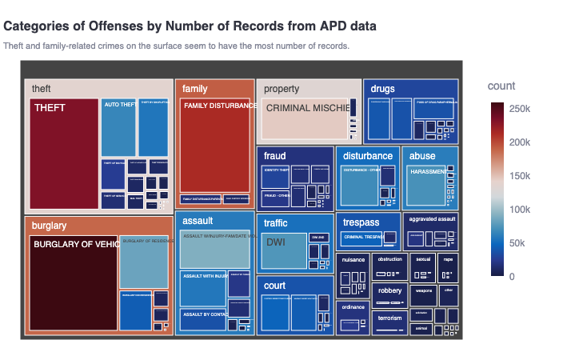
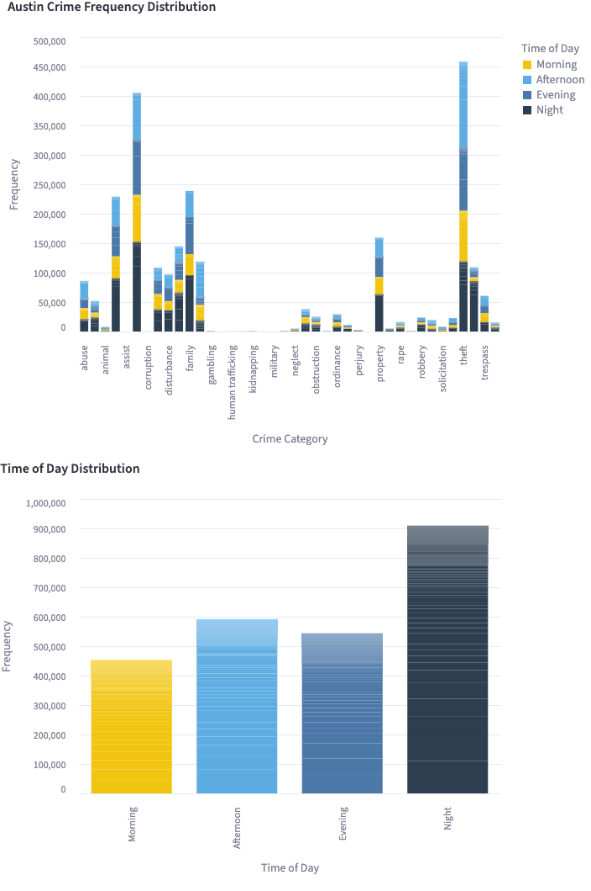
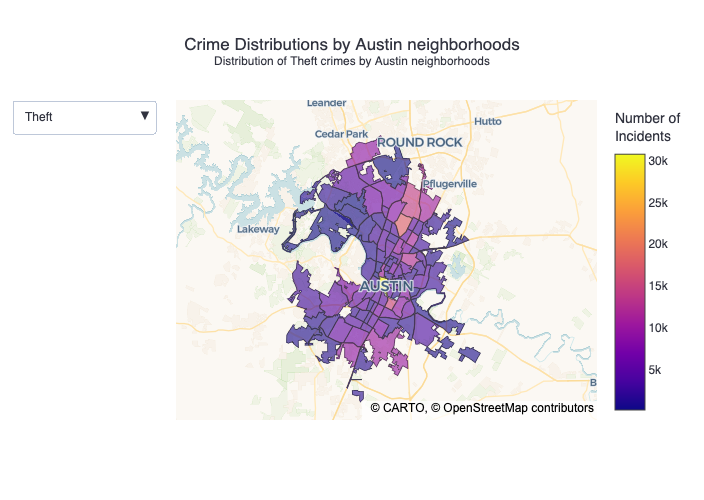
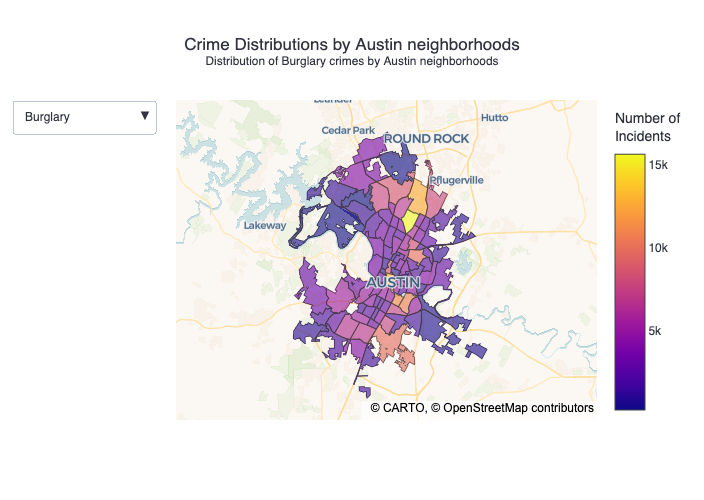
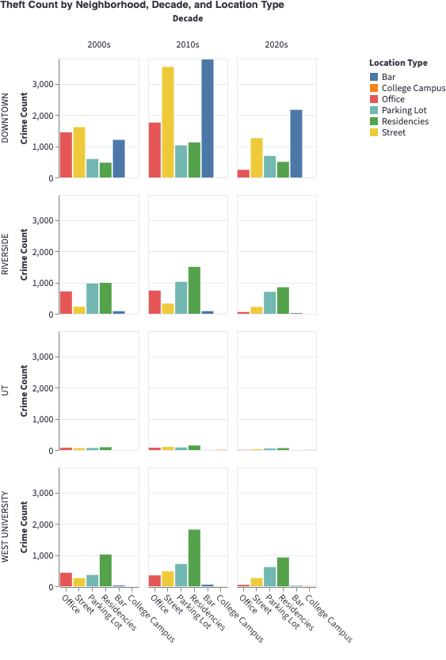
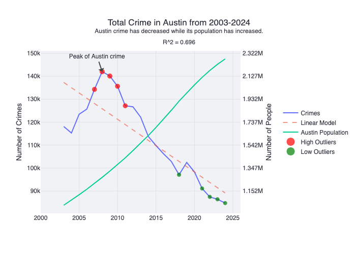
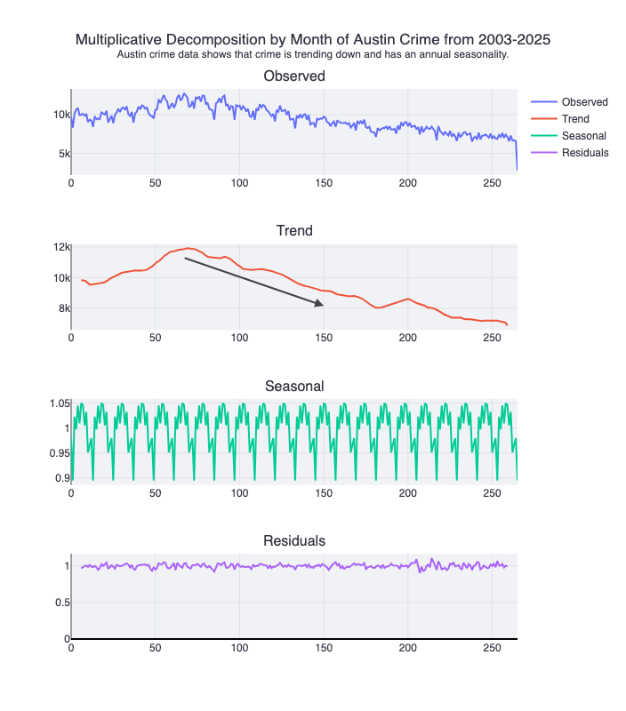
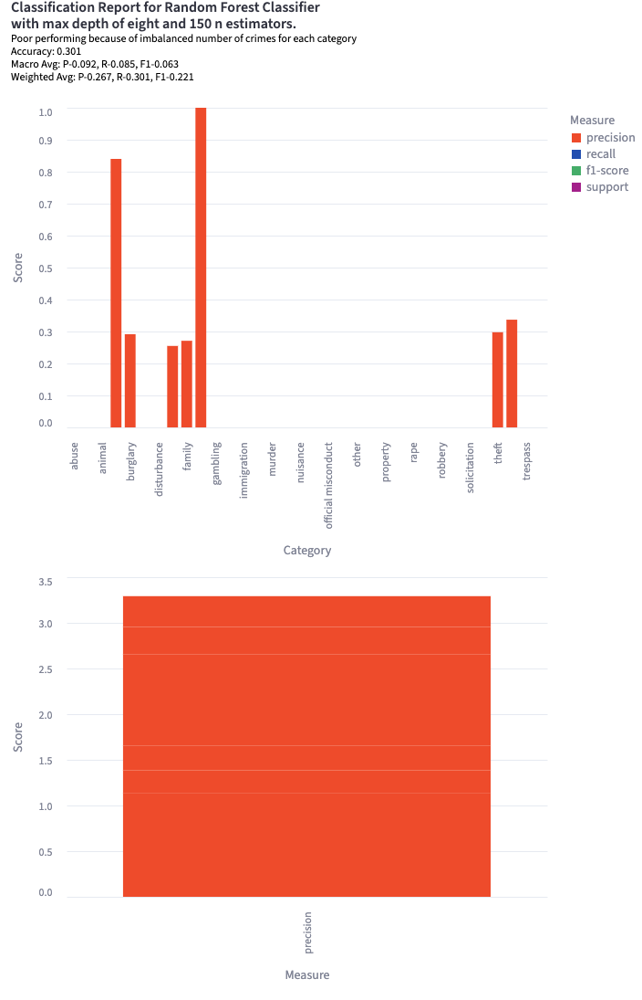

# Austin Crime: In Perspective

## A dashboard about Austin crime by Diego Torrealba, Alex Domond and Jenna Nega. 

### Introduction

As people who live in Austin and go to UT, we're interested in looking at how Austin crime has evolved over the years and what important information or patterns should be noted from the data.

### Visualization One: What types of Crime are happening in Austin?

First, the overview of crimes shows that theft and burglary are the most common crime categories in Austin.

### Visualization Two: When do these crimes happen?

Theft in Austin most commonly occurs in the afternoon, while burglary is most common at night. 

### Visualization Three: Where in Austin is crime most prevalent? 

Downtown Austin is by far the leading neighborhood in theft in Austin, while Riverside has third most thefts. Downtown and Riverside have high counts of burglary, but North Austin has the highest burglary rates. 

Generally, high crime frequency across categories for Downtown, Riverside and North Lamar Rundberg. 

### Visualization Four: Location Type Deep Dives: In what locations should we be most aware?

In West Campus and Riverside, theft is most common in parking lots and at residencies, while in Downtown, most thefts occur on the street or inside of bars. Fortunately, theft is not very common on UT's campus

### Visualization Five: Is Austin becoming safer overall?

Overall, the count of crimes in Austin has steadily decreased since 2003 even with a population boom.

Austin crime continually gone down since its peak at 142,000 crimes in 2008.

### Visualization Six: Multiplicative Decomposition of Austin Crime

This reinforces the idea that Austin crime is trending down. Additionally, there is evidence of seasonality with monthly crimes, with months having distinct average crime frequencies

### Visualization Seven: Random Forest Classifier

The poor-performing model demonstrates the imbalanced number of observations for each category as well as not enough information to be able to confidently determine the category of crime based on available variables.

### Conclusion

* Theft and burglary offenses are the most common category of crime in Austin.
* Theft has historically occurred mostly in the afternoon while burglary occurs commonly at night.
* Downtown Austin and Riverside lead in theft and burglary crimes in Austin.
* In West Campus and Riverside, theft is most common in parking lots and residences.
* In Downtown, most thefts occur on the street or inside bars.
* Austin crime has steadily declined since 2008 despite Austin's population increase.
* Austin crime exhibits a seasonality by year, with months having similar crime frequencies across years.
* Immense imbalances in the observances of different crime categories show how violent crime, excluding theft and burglary, is uncommon due to how large the dataset is.
